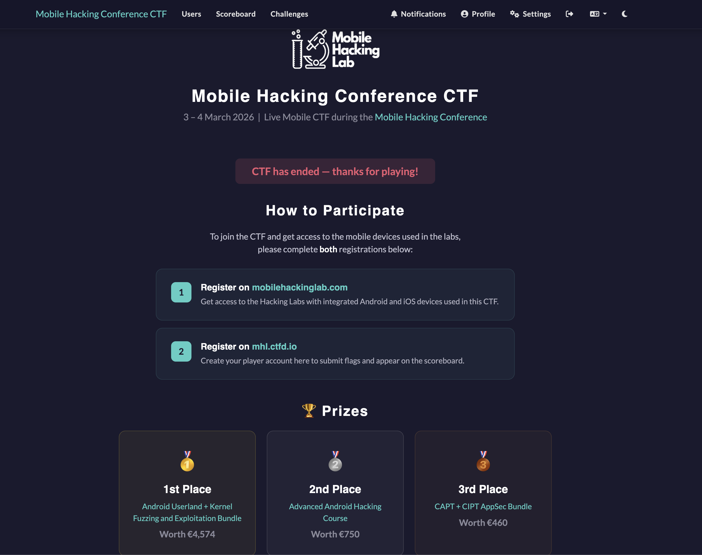
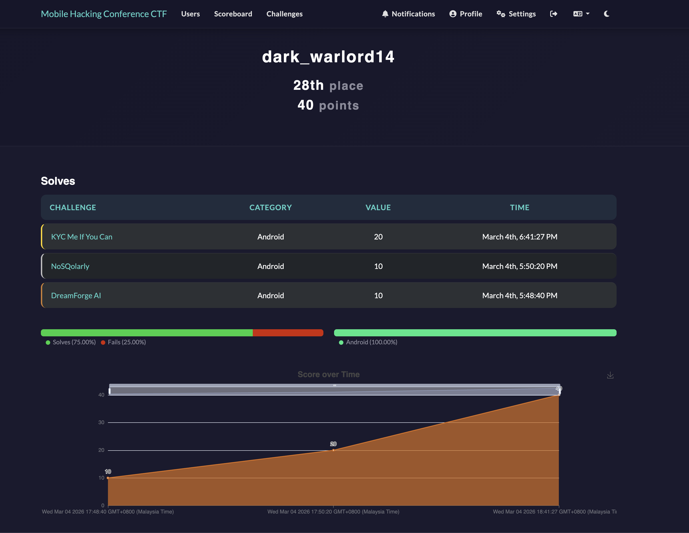

# Mobile Hacking Conference CTF 2026

## Competition Overview

The Mobile Hacking Conference CTF is a live mobile security CTF organized by **Mobile Hacking Lab**, held during the Mobile Hacking Conference. Participants required access to Hacking Labs with integrated Android and iOS devices to interact with challenges.

**Website:** https://mhl.ctfd.io/

## Competition Details

- **Organizer:** Mobile Hacking Lab
- **Dates:** March 3–4, 2026
- **Format:** Live CTF during the Mobile Hacking Conference
- **Platform:** mhl.ctfd.io (challenges) + mobilehackinglab.com (lab device access)
- **Focus:** Mobile Security (Android & iOS)

## Prizes

| Place | Prize | Value |
|-------|-------|-------|
| 1st | Android Userland + Kernel Fuzzing and Exploitation Bundle | €4,574 |
| 2nd | Advanced Android Hacking Course | €750 |
| 3rd | CAPT + CIPT AppSec Bundle | €460 |

## Our Performance

| Field | Details |
|-------|---------|
| **Username** | dark_warlord14 |
| **Final Rank** | 28th place |
| **Score** | 40 points |
| **Solve Rate** | 75% solves, 25% fails |
| **Category Coverage** | Android (100%) |

## Writeups

### Android

| Challenge | Points | Vulnerability | Flag |
|-----------|--------|---------------|------|
| [DreamForge AI](android/DreamForge-AI/README.md) | 10 | Client-side prompt guard bypass + prompt injection | `MHC{v01c3_byp4ss_pr0mpt_1nj3ct}` |
| [NoSQolarly](android/NoSQolarly/README.md) | 10 | N1QL injection + AI prompt injection | `MHC{4ll_dbs_bl33d_th3_s4m3}` |
| [KYC Me If You Can](android/KYC-Me-If-You-Can/README.md) | 20 | Hardcoded JWT secret + FaceNet model extraction + OSINT photo crop bypass | `MHC{d33pf4k3_kyc_pwn3d_mhl}` |
